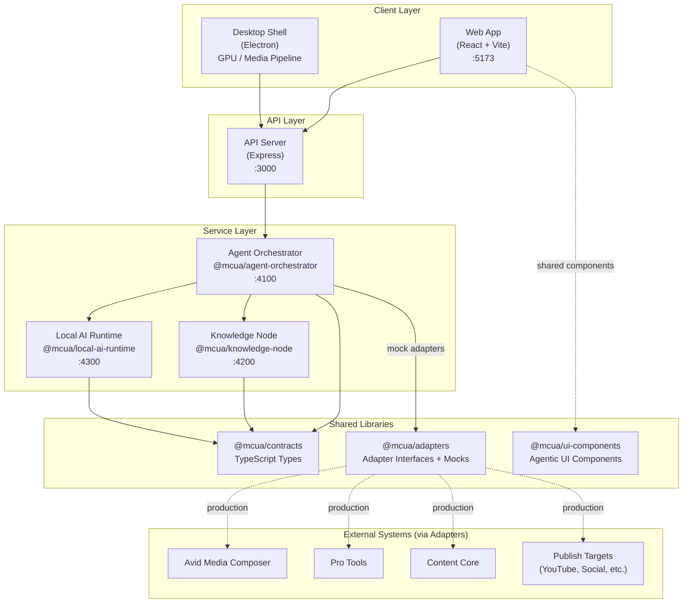
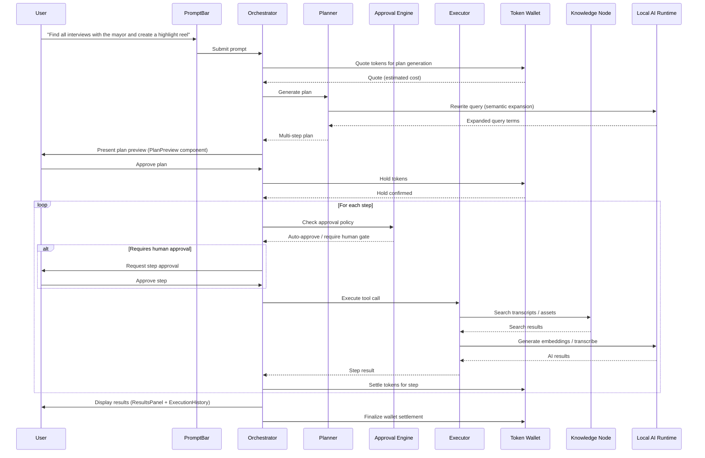
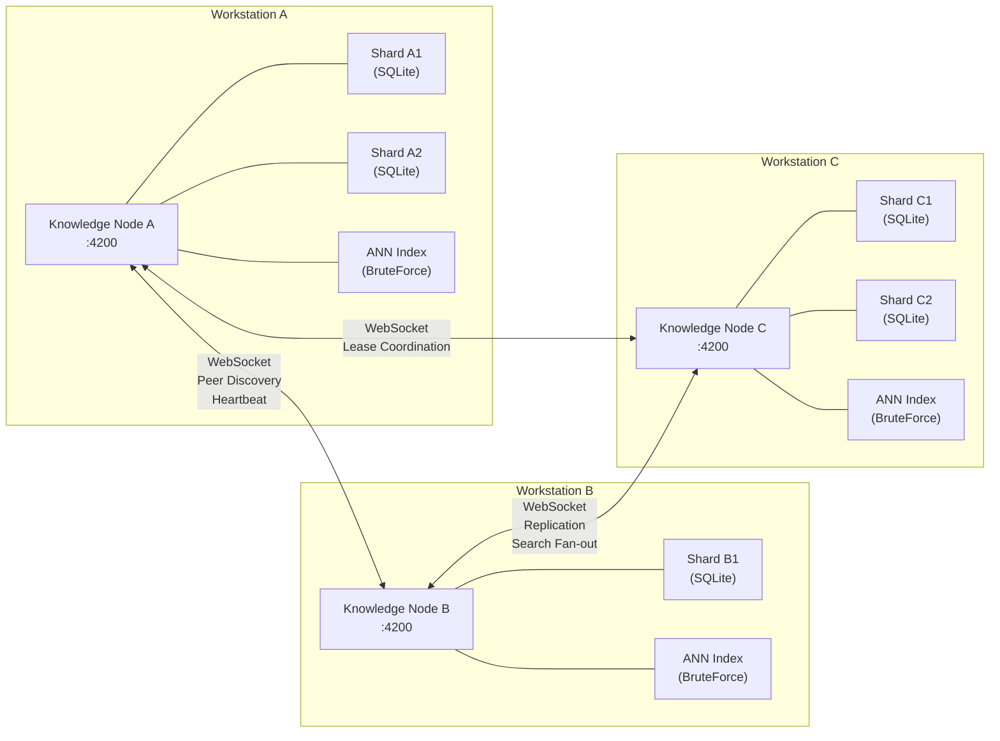
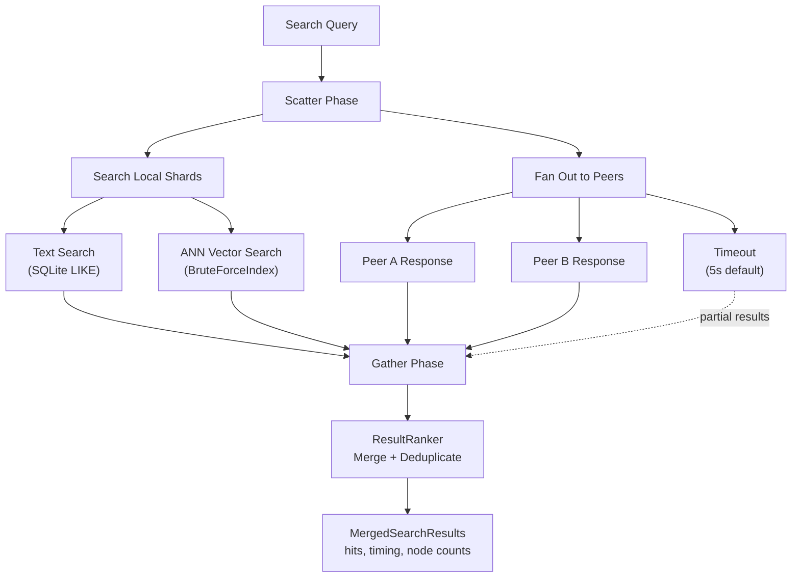
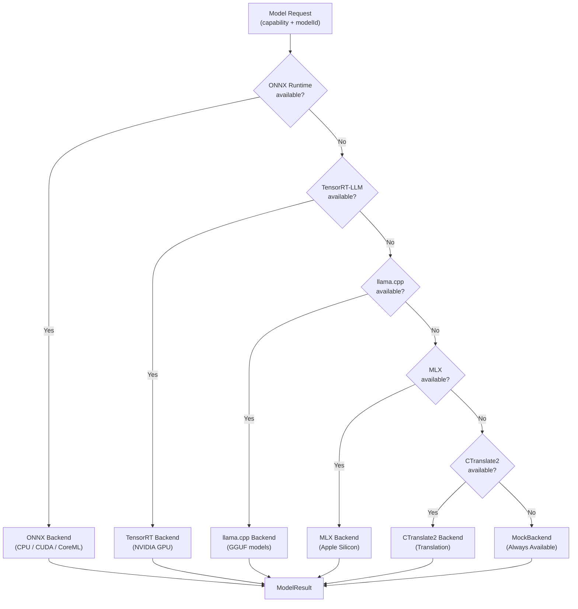
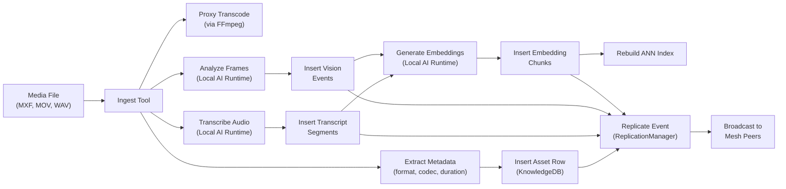
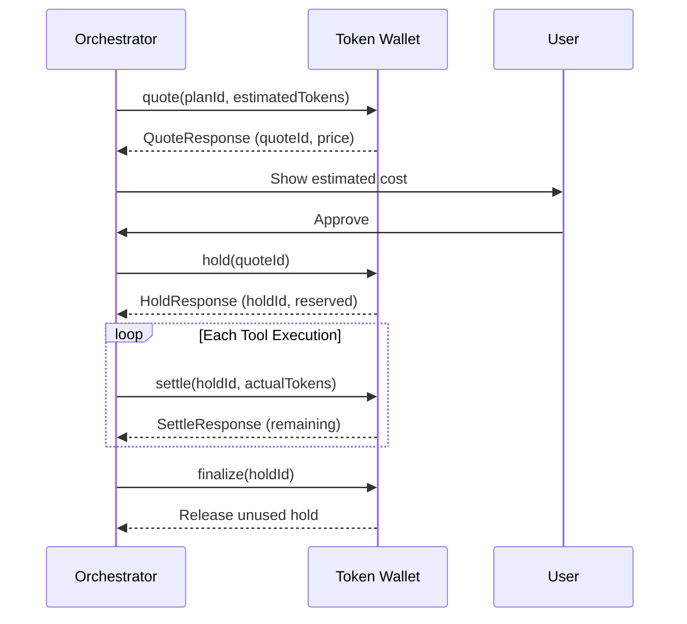

# Architecture Diagram

## System Overview

## User Prompt Lifecycle

## Knowledge Node Mesh Topology

### Mesh Operations

## AI Runtime Backend Resolution

## Data Flow: Asset Ingestion

## Token Wallet Flow

