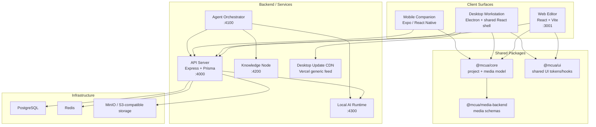
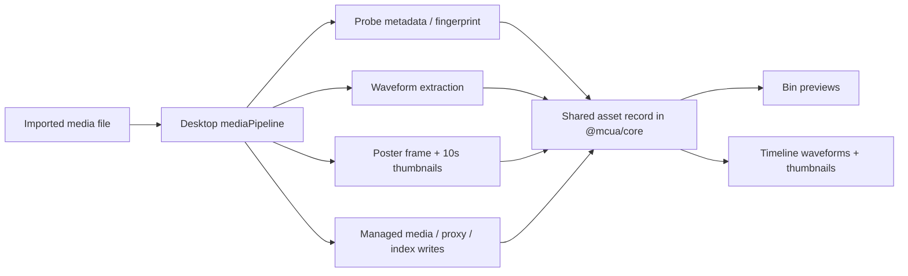
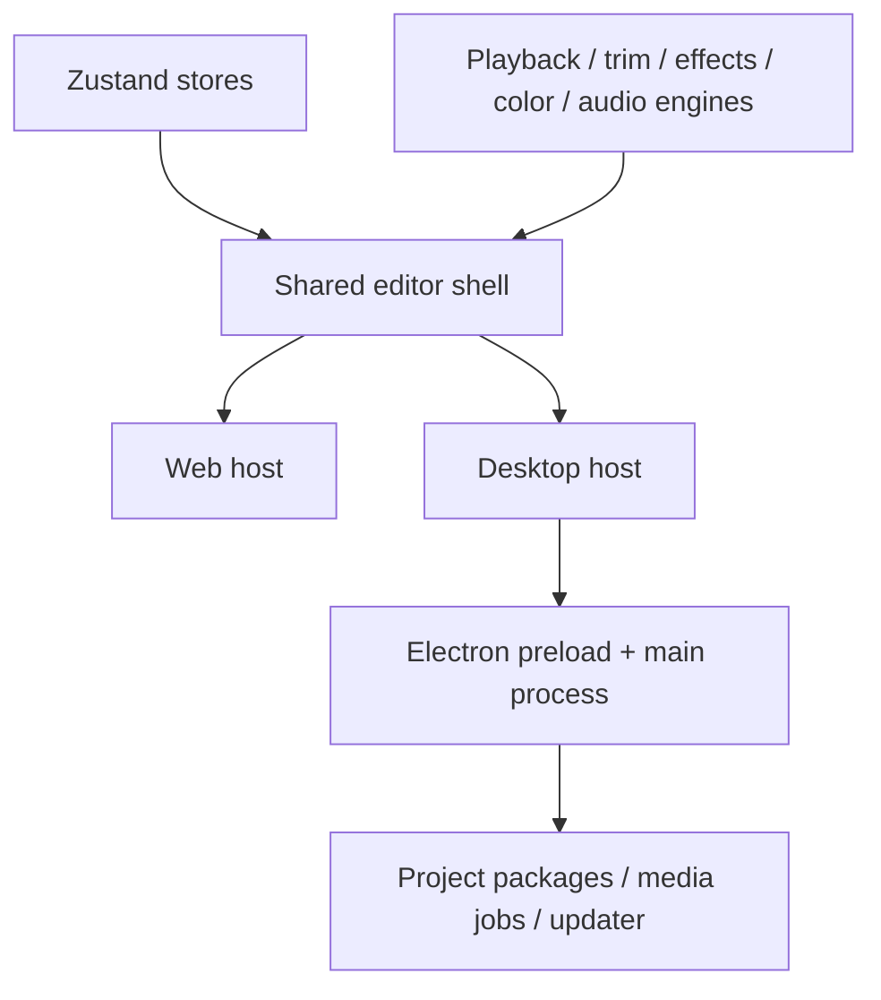

# Architecture Diagram

## Runtime Overview

```mermaid
graph TB
    subgraph "Client Surfaces"
        WEB["Web Editor<br/>React + Vite<br/>:3001"]
        DESKTOP["Desktop Workstation<br/>Electron + shared React shell"]
        MOBILE["Mobile Companion<br/>Expo / React Native"]
    end

    subgraph "Shared Packages"
        CORE["@mcua/core<br/>project + media model"]
        MEDIA["@mcua/media-backend<br/>media schemas"]
        UI["@mcua/ui<br/>shared UI tokens/hooks"]
    end

    subgraph "Backend / Services"
        API["API Server<br/>Express + Prisma<br/>:4000"]
        ORCH["Agent Orchestrator<br/>:4100"]
        KNOW["Knowledge Node<br/>:4200"]
        AIR["Local AI Runtime<br/>:4300"]
        UPDATES["Desktop Update CDN<br/>Vercel generic feed"]
    end

    subgraph "Infrastructure"
        PG["PostgreSQL"]
        REDIS["Redis"]
        MINIO["MinIO / S3-compatible storage"]
    end

    WEB --> CORE
    WEB --> UI
    DESKTOP --> CORE
    DESKTOP --> UI
    DESKTOP --> UPDATES
    MOBILE --> CORE

    WEB --> API
    DESKTOP --> API
    MOBILE --> API

    API --> PG
    API --> REDIS
    API --> MINIO
    API --> AIR

    ORCH --> KNOW
    ORCH --> AIR
    ORCH --> API

    CORE --> MEDIA
```

## Desktop Media Flow

```mermaid
graph LR
    FILE["Imported media file"] --> INGEST["Desktop mediaPipeline"]
    INGEST --> PROBE["Probe metadata / fingerprint"]
    INGEST --> WF["Waveform extraction"]
    INGEST --> THUMBS["Poster frame + 10s thumbnails"]
    INGEST --> MANAGED["Managed media / proxy / index writes"]

    PROBE --> COREASSET["Shared asset record in @mcua/core"]
    WF --> COREASSET
    THUMBS --> COREASSET
    MANAGED --> COREASSET

    COREASSET --> BIN["Bin previews"]
    COREASSET --> TL["Timeline waveforms + thumbnails"]
```

## Editor Surface Sharing

```mermaid
graph TD
    STORES["Zustand stores"] --> SHELL["Shared editor shell"]
    ENGINES["Playback / trim / effects / color / audio engines"] --> SHELL
    SHELL --> WEBHOST["Web host"]
    SHELL --> DESKTOPHOST["Desktop host"]

    DESKTOPHOST --> NATIVE["Electron preload + main process"]
    NATIVE --> PROJECTS["Project packages / media jobs / updater"]
```
