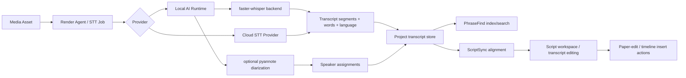

# Speech To Text, PhraseFind, and ScriptSync Architecture

## Decision

The default local speech-to-text engine for this repository is `faster-whisper`.

Why:
- [`faster-whisper`](https://github.com/SYSTRAN/faster-whisper) is actively maintained, runs on CPU and CUDA GPU, exposes word timestamps, and is built on CTranslate2 for practical local inference.
- Official Avid PhraseFind and ScriptSync positioning is editorially specific, but it does not require us to mimic a closed phonetic index implementation byte-for-byte. We need equivalent editorial outcomes: searchable spoken-word media, script-to-footage alignment, and transcript-led editing.
- Avid positions PhraseFind as fast spoken-word search across clips and ScriptSync as script-aligned editing inside Media Composer workflows. That parity target is clear from the official product pages and getting-started material:
  - [PhraseFind](https://www.avid.com/products/media-composer-option-phrasefind)
  - [ScriptSync](https://www.avid.com/products/media-composer-option-scriptsync)
  - [PhraseFind and ScriptSync guide](https://resources.avid.com/SupportFiles/attach/Media_Composer/PhraseFind_and_ScriptSync_v2023.12_Getting_Started_Guide.pdf)

## Research Summary

### Local STT engines

- [`faster-whisper`](https://github.com/SYSTRAN/faster-whisper): best default local engine for this codebase.
  - Strengths: CPU and CUDA support, multilingual Whisper models, word timestamps, good runtime characteristics, simple Python integration.
  - Tradeoff: no first-class Apple GPU path.
- [`whisper.cpp`](https://github.com/ggml-org/whisper.cpp): best lightweight fallback for CPU and Apple-focused local deployments.
  - Strengths: tiny footprint, portable, excellent for CPU-only environments, strong Apple story.
  - Tradeoff: less natural fit with the repo's existing Python/CTranslate2-oriented local-runtime design.
- [`pyannote-audio`](https://github.com/pyannote/pyannote-audio): best open diarization sidecar.
  - Strengths: strong diarization quality, standard choice for speaker segmentation.
  - Tradeoff: heavier install, Hugging Face token requirement, should remain optional.

### Avid parity target

The official Avid materials emphasize:
- PhraseFind: search by spoken phrase across clips and bins, then jump directly to matching media.
- ScriptSync: align script text to spoken footage, navigate by line, and use those aligned regions for editorial decisions.
- ScriptSync AI: modernized workflow built on transcription/alignment, not only manual marking.

That means our parity target is:
- word-timestamped transcript ingestion
- phrase search over aligned transcript text
- persisted speaker metadata
- persisted script document with line-to-cue linkage
- paper-edit style transcript/script navigation

## Architecture

## Provider model

### Local

- Provider id: `local-faster-whisper`
- Runtime surface: `services/local-ai-runtime`
- Backend: `FasterWhisperBackend`
- Optional sidecar: `pyannote.audio` for diarization

### Cloud

- Provider id: `cloud-openai-compatible`
- Intended surface: API or render-agent compatible STT endpoint
- Current implementation status: scaffolded through provider settings and existing render-agent cloud path

## Data model

### Transcript

Project transcript cues now carry:
- cue text
- source asset id
- start/end time
- confidence
- speaker label and optional speaker id
- optional word-level timings
- provider id
- optional translation
- linked script line ids

### Script document

Project script state now persists:
- script title
- source type (`IMPORTED`, `MANUAL`, `GENERATED`)
- language
- raw text
- parsed lines
- per-line linked transcript cue ids

### Provider settings

User settings now persist:
- transcription provider
- translation provider
- auto/manual language mode
- preferred language
- translation target language
- diarization enabled
- speaker identification enabled

## Implemented in this slice

- Real local backend added: `services/local-ai-runtime/src/backends/FasterWhisperBackend.ts`
- Real subprocess runner added: `services/local-ai-runtime/src/backends/faster_whisper_runner.py`
- Local runtime `/transcribe` now accepts diarization and task options
- Local runtime `/transcribe-upload` now accepts raw uploaded media bytes, so browser and desktop flows can transcribe `File`, `blob:`, and fetched media without relying on a stable local file path
- Render agent can route transcription jobs through the local runtime instead of only cloud/mock paths
- Project model now persists richer transcript metadata plus a script document
- Web editor now has a combined PhraseFind / ScriptSync workbench instead of the old demo-only script panel
- User settings now persist local/cloud transcription preferences
- Web editor now has a real transcription client that can:
  - transcribe local file-path media through the runtime
  - upload in-memory media to the runtime
  - route STT through an optional cloud OpenAI-compatible endpoint
  - optionally translate transcript cues through local or cloud translation providers
- Transcript import now supports `SRT`, `VTT`, and structured `JSON`
- Script import now supports plain-text paper scripts and persists them as imported script documents
- Generated scripts can now be built directly from transcript cues
- Transcript cues and linked script lines now support direct editorial actions:
  - load to source
  - mark cue range
  - insert cue/line selection
  - overwrite cue/line selection
  - build multi-cue paper edits from selected transcript ranges

## Remaining gaps

- Apple GPU-native local STT backend, likely `whisper.cpp` or MLX-backed, is still not implemented.
- Speaker identification beyond diarized anonymous labels still needs a higher-level identity resolution flow.
- PhraseFind is text-and-alignment based today; a deeper phonetic/fuzzy spoken index would be a future fidelity pass.
- Full ScriptSync import/export interoperability with Avid-specific assets is still out of scope for this slice.
- Transcript-driven editing is now operational, but it is not yet full Avid ScriptSync parity:
  - no dedicated script bin/workspace choreography
  - no scripted takes grouping or scene/slate organization model
  - no line-level audition/take comparison UI
  - no Avid-specific script metadata interchange
- Cloud transcription is now executable, but it depends on runtime configuration through browser env vars rather than a facility-managed provider registry.

## Operational notes

- Local runtime expects Python with `faster-whisper` installed in the configured interpreter.
- Optional diarization requires `pyannote.audio` and `PYANNOTE_AUTH_TOKEN`.
- Recommended environment variables:
  - `LOCAL_STT_PYTHON_BIN`
  - `LOCAL_STT_DEVICE`
  - `LOCAL_STT_COMPUTE_TYPE`
  - `LOCAL_STT_MODEL_CACHE_DIR`
  - `LOCAL_AI_RUNTIME_URL`
  - `PYANNOTE_AUTH_TOKEN`
- Browser/client env vars for optional remote routing:
  - `VITE_LOCAL_AI_RUNTIME_URL`
  - `VITE_CLOUD_TRANSCRIPTION_URL`
  - `VITE_CLOUD_TRANSCRIPTION_API_KEY`
  - `VITE_CLOUD_TRANSCRIPTION_MODEL`
  - `VITE_CLOUD_TRANSLATION_URL`
  - `VITE_CLOUD_TRANSLATION_API_KEY`
